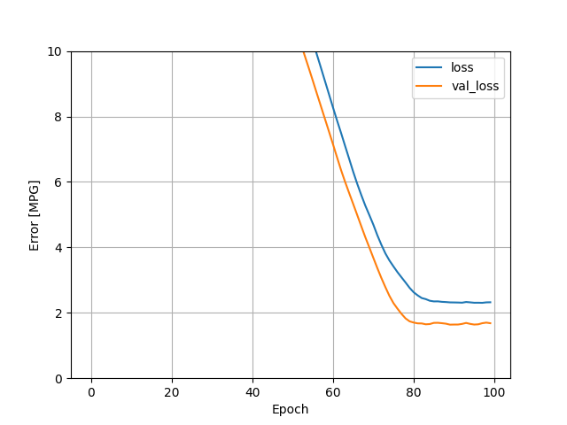
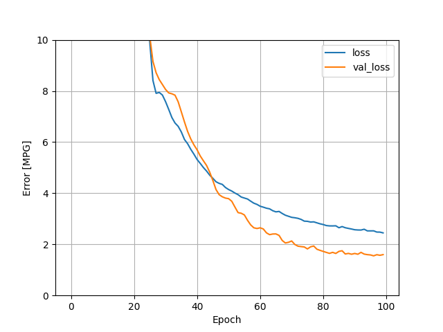
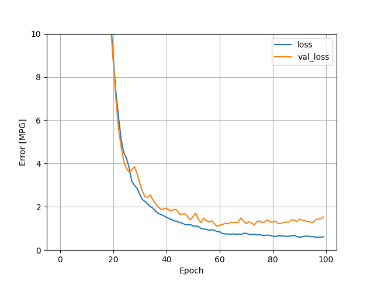

# Auto Imports Regression

Given the variables of Highway MPG, Num of Cylinders, Engine Size, Horsepower, and Curb Weight, I 
produced a multi-class linear regression, and a multi-class
DNN regression to predict Highway MPG.

The linear regression looked like this:

 

The loss was somewhat above 2, and the val_loss was below 2. 

For the DNN regression, my loss graph looked like this:

The result at epoch 100 looks quite similar to the result at
epoch 100 of the linear model, but the loss values at the epochs
leading up to 100 were lower compared to the linear model. Essentially,
the slope of the DNN graph was less than the slope of the linear graph.
So I conclude that DNN produces a better model.

## Best Model

The best model that we were able to produce was a DNN model, 
with the variables Highway MPG, Num of Cylinders, Engine Size, Horsepower,
Curb Weight, Fuel Type, Number of Doors, Make, Width, and City
MPG. This is the plot for those variables.

