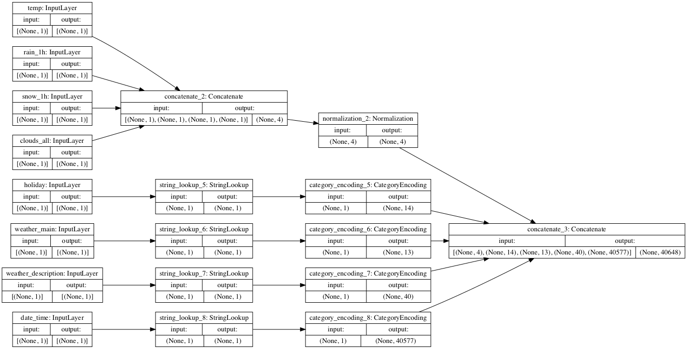
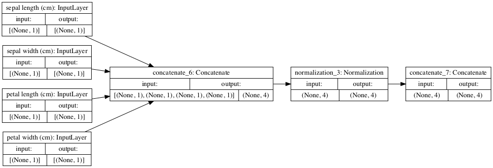

# Load CSV Exercise for Traffic Volume and Iris Data

## Metro Interstate Traffic Volume Data Set

When I ran the titanic code that we previously developed for
the traffic volume dataset, I got some interesting results.
I only changed 2 things in the code - the link to the dataset,
and the variable to pop (which was 'traffic_volume'). This is
what my input preprocessing model looks like:

I can see that it is taking all the numerical inputs and combining
them. Later on, it takes the string inputs, and converts them
into numerical inputs, and then combines all the inputs to 
make the model. There are different ways to reach the 
conclusion, based on if you start with a string input
or a numerical input.

When I fit this model, I was surprised to see that my loss was
negative.

    Epoch 10/10
    1507/1507 [==============================] - 19s 12ms/step - loss: -226190576.0000

The loss is over -226,000,000. This was really strange, so I 
decided to change the popped variable to see if I could make it
any better. I changed it to 'weather_main', but was unable to
get the model to run. This is because the model is trying to
predict a string value by coming up with floats, 
which is not possible to do. 

So then, I tried a numerical value - 'rain_1h' as my popped 
variable.

    Epoch 10/10
    1507/1507 [==============================] - 17s 11ms/step - loss: -39.9785

This definitely improved the loss values.

## Iris Dataset

In the case of the Iris dataset, all the variables were numeric,
even the target (0, 1, 2 each corresponded to a different flower).
So the model chart looks a bit different from the Metro dataset.

One thing that I noticed is that in both images, only the
numerical values go through normalization. Normalization is used
to recenter and rescale the data, which makes sense since some
numerical features are on different scales than others.

My loss for the iris data was also negative, but it took a 
shorter amount of time for the fitting to run, which was 
probably due to the smaller amount of steps per epoch.

    Epoch 10/10
    5/5 [==============================] - 0s 857us/step - loss: -0.9684

The loss is the smallest loss out of the two (three if you are including
the 'rain_1h' loss) losses that I have gotten. I'm not sure of the
significance of negative losses. Could they mean that the model
is performing well, perhaps too well? 

