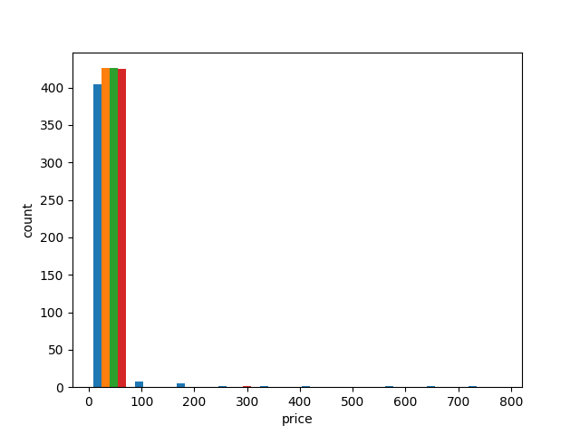
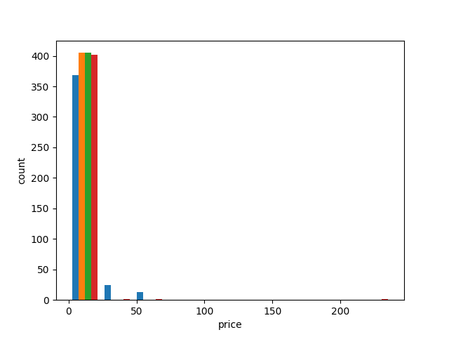
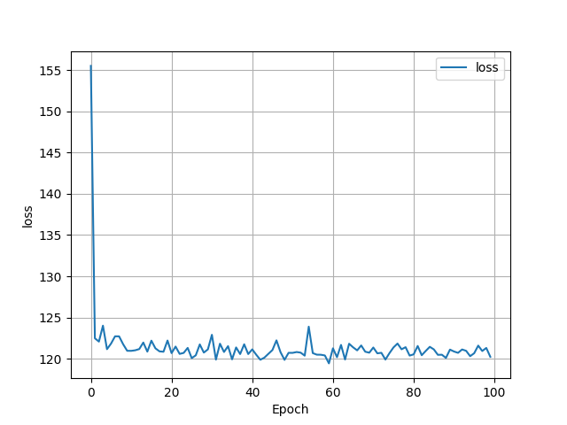
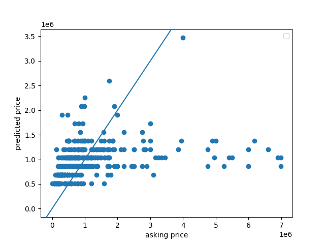
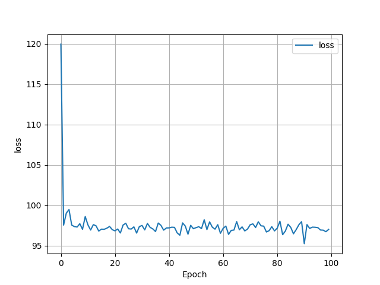
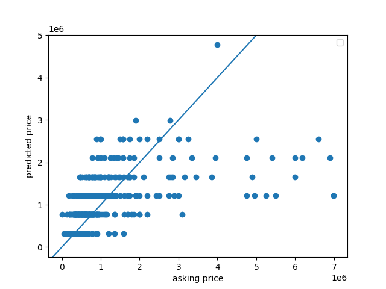
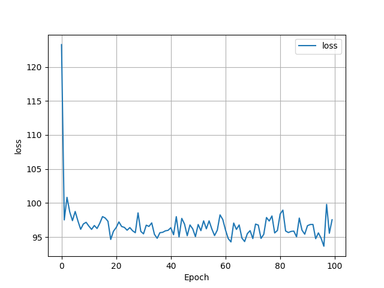
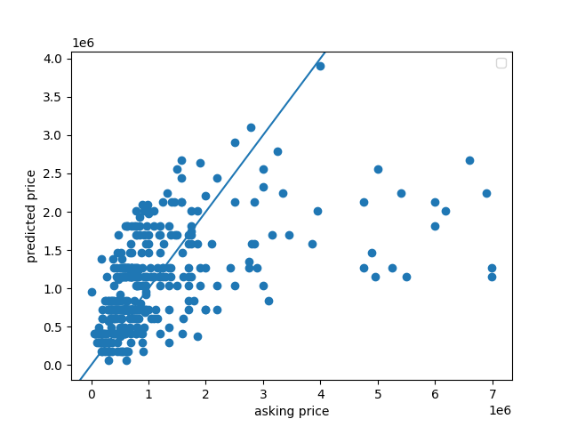

# Project 1 - Housing Model

This project was very interesting, because we were able to use 
real life data as opposed to computer generated data. That being
said, I did run into some difficulties with this project, in which 
I will go into more detail below. 

## Q1: How did your model fare?

I ran into some issues while creating my model. At first, I used
all three variables: bedrooms, bathrooms, and livingArea. However, 
when I ran my model with those variables, my loss became so large 
that the computer had to display it as 'inf' (infinity) and eventually
'nan' (not a number). I got these errors with and without standardization
of my livingArea variable. 

So I decided to break down the data and reduce it. Below
is a histogram of my original data. I decided to get information
on houses for sale in New York City - so I was expecting some high numbers.

The price axis' scale is in the 100,000s, so most of the data is from 
0 - 10,000,000 dollars. There are some very high end outliers.
So I decided to just use the data from that 0 - 10,000,000 dollar
range. This is the updated graph. 

Even though I reduced the data, I was still getting errors. 
So I decided to reduce the variables that I was using. 

At first, I started with just the bedrooms variable. My loss
graph ended up looking like this:

and the scatterplot comparing predicted and actual prices looked like this:

My MSE was 144.16894399620398. Based on the scatterplot, a lot of my values 
were underneath the y = x line. This model doesn't seem that 
good, especially because the mse was quite large.

So I decided to try running my model just on the bathroom data. 

 

The loss was less in this data. 

This scatterplot looks similar to the bedroom scatterplot, with 
but as you can see, most of the predicted points are wildly incorrect. 
The highest asking price was $7,000,000, but the model predicted 
the price to be around $1,250,000. The MSE for the bathroom
model was 169.7700979384024, so even higher than the bedroom model.

So, I decided to combine both of these models. 

The final loss looks to be about 96-97, similar to the bathroom model's
loss graph. 

The points on this graph definitely look more clustered 
around the y = x line, but they still look incorrect overall.
The MSE that I got for this model was 169.69158518502266, so
similar to (but a little less than) the bathroom data. 
This MSE is very high. 

I believe that if I was able to resolve my issues with the 
livingArea variable, I might have gotten a more accurate model. 

## Q2: In your estimation is there a particular variable that may improve model performance?

Like I said above, if I was able to add the livingArea variable to my
model, I think it would have become more accurate. Because although
bedrooms and bathrooms are a somewhat accurate way of predicting house price,
the size of the house is the biggest giveaway. But out of the two
variables I tested, bedrooms seemed to have the smallest MSE. 

## Q3: Which of the predictions were the most accurate? In which percentile do these most accurate predictions reside? Did your model trend towards over or under predicting home values?

I ran a quick for loop to help me find the point with the smallest 
difference between the y and y_pred values for my bedroom + bathroom
model. Here it is:

    smallest_y_pred = y_pred[0]
    difference = abs(y[0] - y_pred[0])
    index = 0
    for i in range(len(y_pred)):
        if abs(y[i] - y_pred[i]) < difference:
        smallest_y_pred = y_pred[i]
        difference = abs(y[i] - y_pred[i])
        index = i

From this code, I found that the most accurate prediction was
$795,473, and the actual price was $795,000. This is definitely in
the lower end of the scale, since my scale goes from $0 - 
$10,000,000. This is actually easily seen on my scatterplot -
most of the predictions from about $3,000,000 onwards fell far
under the line. I calculated that this point is above the 50th
percentile, but below the 75th percentile. 

My model trended towards under predicting home values. There were
222 values that were under predicted, 183 values that were over predicted,
and 0 values that were exactly predicted. I found this out by just 
making a for loop and comparing each of the y_pred values to the y 
values and incrementing a counter as necessary. 

## Q4: Which feature appears to be the most significant predictor?

I believe that the bedrooms are the most significant predictor
just based on the lower MSE. If I had figured out how to incorporate
livingArea, I believe that would have had a much greater impact
on the model. But with the predictors I have, I would have to
go with bedrooms. 

