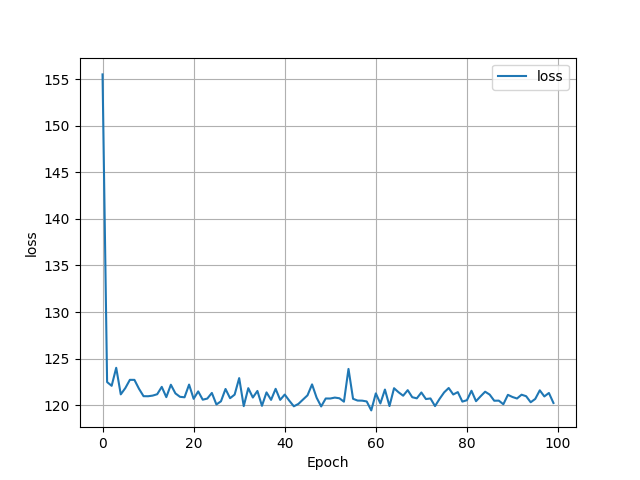
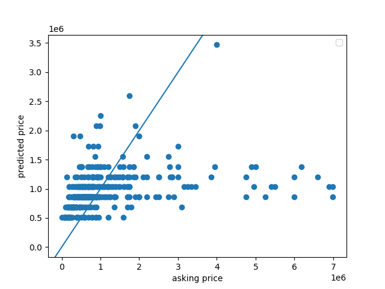
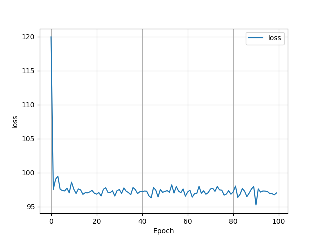

# Project 1

This project was very interesting, because we were able to use
real life data as opposed to computer generated data. That being
said, I did run into some difficulties with this project, in which
I will go into more detail below. 

## Q1: How did your model fare?

I ran into some issues while creating my model. At first, I used
all three variables: bedrooms, bathrooms, and livingArea. However,
when I ran my model with those variables, my loss became so large
that the computer had to display it as 'inf' (infinity) and eventually
'nan' (not a number). I got these errors with and without standardization
of my livingArea variable.

So I decided to break down the data and find the source of the error.
Eventually, I figured out that one of the points had a low price
but a strangely high livingArea value. Once I dropped that point, my
model was able to run without any strange losses. 

Below is a histogram of my original data. I decided to get information
on houses for sale in New York City - so I was expecting some high numbers.

The price axis' scale is in the 100,000s, so most of the data is from
0 - 10,000,000 dollars. There are some very high-end outliers.

Earlier, when I was having trouble with my livingArea predictor, I decided
to reduce the variables that I was using and I made plots of individual predictors.

At first, I started with just the bedrooms variable. My loss
graph ended up looking like this:At first, I started with just the bedrooms variable. My loss
graph ended up looking like this:

and the scatterplot comparing predicted and actual prices looked like this:

My MSE was 144.16894399620398. Based on the scatterplot, a lot of my values
were underneath the y = x line. This model doesn't seem that
good, especially because the mse was quite large.

So I decided to try running my model just on the bathroom data.

The loss was less in this data.

This scatterplot looks similar to the bedroom scatterplot, with
but as you can see, most of the predicted points are wildly incorrect.
The highest asking price was $7,000,000, but the model predicted
the price to be around $1,250,000. The MSE for the bathroom
model was 169.7700979384024, so even higher than the bedroom model.

Next, I tested the livingArea variable. 

The loss was huge in this case!

And this plot looks strange as well. The model over predicted the smallest
values, and underpredicted the largest values. The MSE
for this model was 7460.597306995476, which is really high, but it makes
sense considering the amount of incorrect points.

Once I found the source of the error, I decided to combine all of these models. 

This loss graph looks very different from the other loss graphs that we have seen.
The loss extends into the 1000s, almost reachin 10,000 at one point.

The points on this graph definitely look more clustered
around the y = x line, but they still look incorrect overall.
The MSE for this model was 7604.735161108724, which is very high.
I guess that it is this high because it is difficult to accurately 
predict house prices with only a few variables. I also see some negative
points, which might be due to the large out

## Q2: In your estimation is there a particular variable that may improve model performance?

I believe that if we could figure out how to include location as a variable,
that might make the predictions more accurate. New York City has multiple boroughs that are known
to have either higher or lower housing prices, so if the model
knew which neighborhood the house was in, it could have an idea of what the 
average price is there and work from there. 

## Q3: Which of the predictions were the most accurate? In which percentile do these most accurate predictions reside? Did your model trend towards over or under predicting home values?

I ran a quick for loop to help me find the point with the smallest
difference between the y and y_pred values for my
model. Here it is:

    smallest_y_pred = y_pred[0]
    difference = abs(y[0] - y_pred[0])
    index = 0
    for i in range(len(y_pred)):
        if abs(y[i] - y_pred[i]) < difference:
        smallest_y_pred = y_pred[i]
        difference = abs(y[i] - y_pred[i])
        index = i

From this code, I found that the most accurate prediction was
$1,088,221.2, and the actual price was $1,090,000. This is definitely in
the lower end of the scale, since my scale goes from $0 -
$80,000,000. This is actually easily seen on my scatterplot -
most of the predictions from about $30,000,000 onwards fell far
under the line. I calculated that this point is above the 50th
percentile, but below the 75th percentile.

My model trended towards under predicting home values. There were
268 values that were under predicted, 157 values that were over predicted,
and 0 values that were exactly predicted. I found this out by just
making a for loop and comparing each of the y_pred values to the y
values and incrementing a counter as necessary. 

## Q4: Which feature appears to be the most significant predictor?

I believe that the bedrooms are the most significant predictor
just based on the lower MSE. In real life as well, most houses
with a larger number of bedrooms are associated with larger
prices.

## What happens if I remove the outliers?

I noticed that some of my y_pred values were negative, and I had
a feeling that it was because of the outliers on the high end. So I 
made my price range from $0 - $10,000,000. 

By removing the higher outliers, I was able to get all of the 
predicted values above 0. Additionally, removing these large
outliers made my MSE much lower, at about 178.38600496432986. 

