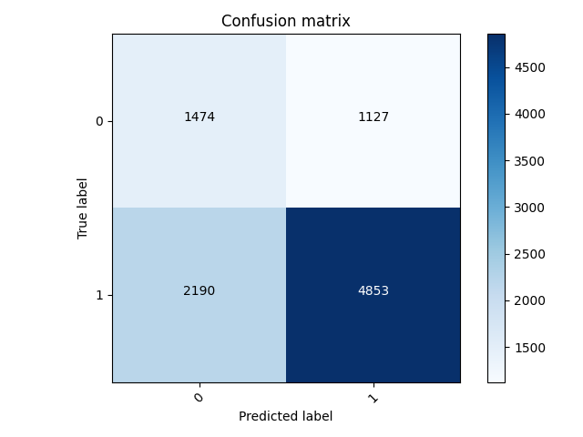
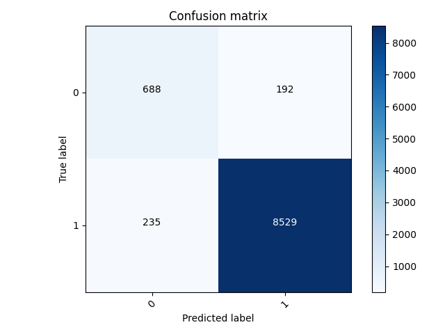
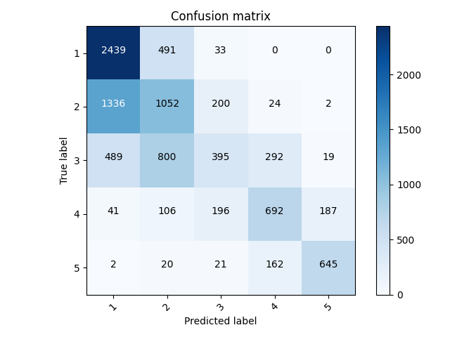
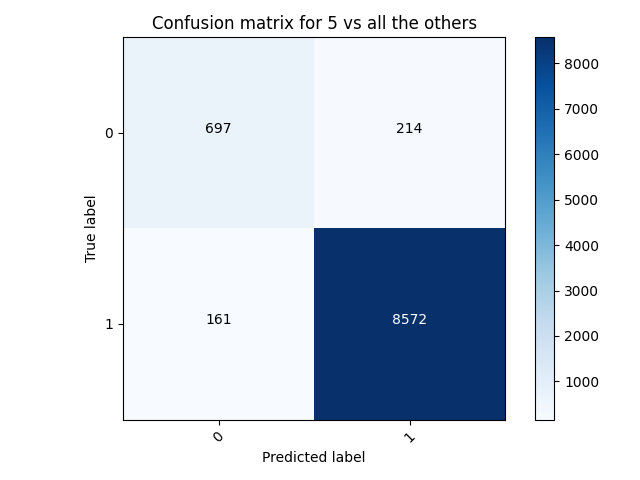
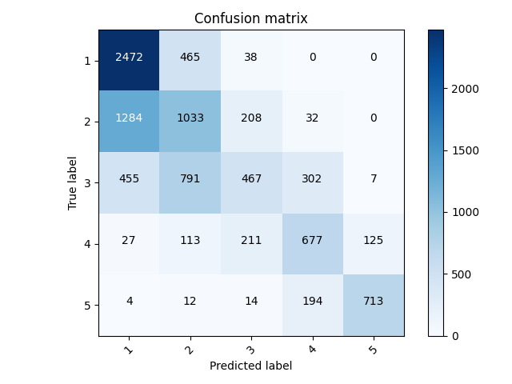

# Project 3

The model that I chose was the Keras Preprocessing Layers model.
I chose this model because it had the best accuracy between the two
models (preprocessing vs feature columns).
The model that I used was using age (numeric), gender,
education (categorical integer), potable, toilet, electric, car,
cook (categorical string).

## Binary Model

My worst wealth class was wealth class 2, with an accuracy of
0.6560555696487427 and a loss of 0.5099.

My best wealth class was wealth class 5, with an accuracy of 0.955723762512207
and a loss of 0.1051.

In wealth class 2, we can see that the model predicted more 0's where it 
should have predicted 1's. I also thought that it was interesting how 
wealth class 1 had a higher accuracy than wealth class 2. I thought that 
the accuracies would start low and get higher for each wealth class,
but that was not the case.

But overall, this model predicted the wealth classes fairly accurately,
with not a lot of error or loss. We can see in the confusion matrix 
for wealth class 5, only a few values were predicted incorrectly. 
And having 300-400 incorrect values out of about 10,000 is 
relatively good.

## Categorical Model

But let's look and see how the model did with predicting the values
overall. The accuracy was 0.535773515701294, and the loss was 0.9958. 

This model was ok in predicting the actual values, but I 
noticed that the other most common predictions were for wealth classes 
that were 1 point greater or lower than the true wealth class. This tells me that the model is not
perfect in distinguishing between wealth classes that are close together.
But the model is generally good at avoiding large differences. It is 
less likely to predict a 5 for wealth class 1.

## Improving the Model

I thought hard about how to make these models better. Eventually,
I decided on adding the location column to the categorical (string) 
columns. 

My worst accuracy was again for wealth class 2, with an accuracy of
0.6926586627960205 and a loss of 0.4854. 

This is better than the accuracy of the previous model. The loss also
decreased. We can see that 
overall, there were more predicted labels matching true labels, and less 
predicted 0's for true 1's. However, the model predicted more 1's where 
it should have predicted 0, as compared to the previous model.

My best accuracy was for wealth class 5. The accuracy was 0.9611157178878784,
and the loss was 0.1011. The accuracy increased and the loss decreased.

The same pattern is visible here. More 0's were predicted as 0, more
1's were predicted as 1, less 1's were predicted as 0. And, there
were more 0's that were predicted as 1's. 

Overall, this model performed better with binary targets. 

When I ran it with the categorical targets, this is the confusion matrix
that came out of it. 

The accuracy was 0.555993378162384, and the loss was 0.9698. This is 
slightly an improvement from the last categorical model.

I believe that if I continue to add more features to the model, it
will become more accurate as time goes on. 