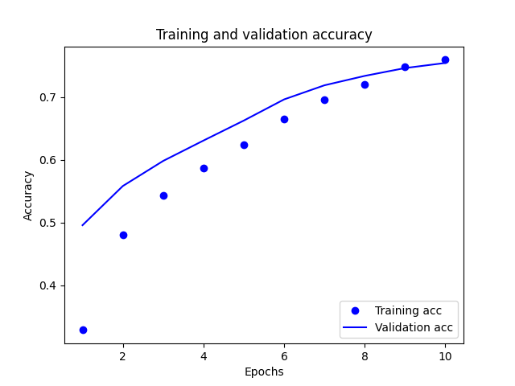
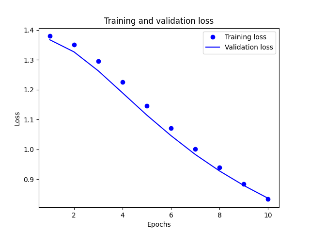

# Thursday's Project
## Aashni Manroa, Julia Lewis, Thomas Miller, DJ Olson

### Provide plots that describe the training and validation loss and accuracy. Interpret the plots. How is this model performing?

The training and validation accuracy:

The training and validation loss:

Training loss decreases with each epoch, and training accuracy increases with each epoch. These changes are caused by using a gradient descent optimization. The usage of a gradient descent optimization minimizes the desired quantity on every iteration. While the validation loss undergoes a similar change, the validation accuracy seems to slightly peak before the training accuracy. Therefore, there could be slight overfitting. Overfitting means that the model does better on the training data than on new data.

### Export the model and print the accuracy produced using the test data. Does the test data accuracy serve to validate your model?
loss: 0.8653 - accuracy: 0.7346 (test data)

loss: 0.4826 - accuracy: 0.8769 (training data)

The test data accuracy is around 73%. In addition, the training data accuracy is around 88%. Due to the training data accuracy being higher than the test data accuracy, the test accuracy validates the information that the model is overfit.

### Produce three examples that are relevant to the multi-class classification model and predicting the language relevant to the stack overflow question. Produce the array generated by each of your three examples. Were these predictions accurate?
array([[0.47182584, 0.37893373, 0.5324805 , 0.60032773],
[0.59606135, 0.56147724, 0.4238422 , 0.41686946],
[0.63881254, 0.7538286 , 0.37287438, 0.2539326 ]], dtype=float32)

The 3 examples in order were written in Python, C#, and Java. To clarify, the output arrays concerning the accuracy of the predictions seem to contain different accuracy values for each class. The classes involve csharp, java, javascript, python. So in the output arrays, the position at index 0 in the array corresponds to C#. The position at index 1 in the array corresponds to Java. The position at index 2 in the array corresponds to Javascript. The position at index 3 in the array corresponds to Python. The model seemed to accurately predict the coding language for each example. However, the accuracies were not that great - ranging from 0.59 to 0.75.

### Compare your multi-class model with your binary class model that predicted sentiment as either positive or negative in response to various movie reviews. What is the most significant difference between the two different types of models? Compare the two models and estimate which demonstrated better performance? Substantiate your response.
(Binary class model) Movie model loss and accuracy on the test data:

loss: 0.3111 - accuracy: 0.8726

array([[0.6165942 ],
[0.4404077 ],
[0.35789335]], dtype=float32)

Movie model loss and accuracy on the training data:
loss: 0.2162 - binary_accuracy: 0.9238

The examples tested for this model were a positive review, a neutral review, and a negative review.

The loss was lower for the movie dataset, and the test data accuracy was higher for the movie dataset as well. Therefore, the movie dataset performed better than the Stack Overflow dataset. This may be because it is more difficult to understand blocks of code than negative and positive words. Additionally, some coding languages are very similar, like Java and Javascript, so it may be hard for the computer to tell the difference between them. We believe that the most significant difference between the two models is the scores on the testing and training data. In both cases, the movie review model scored higher than the Stack Overflow model. 
