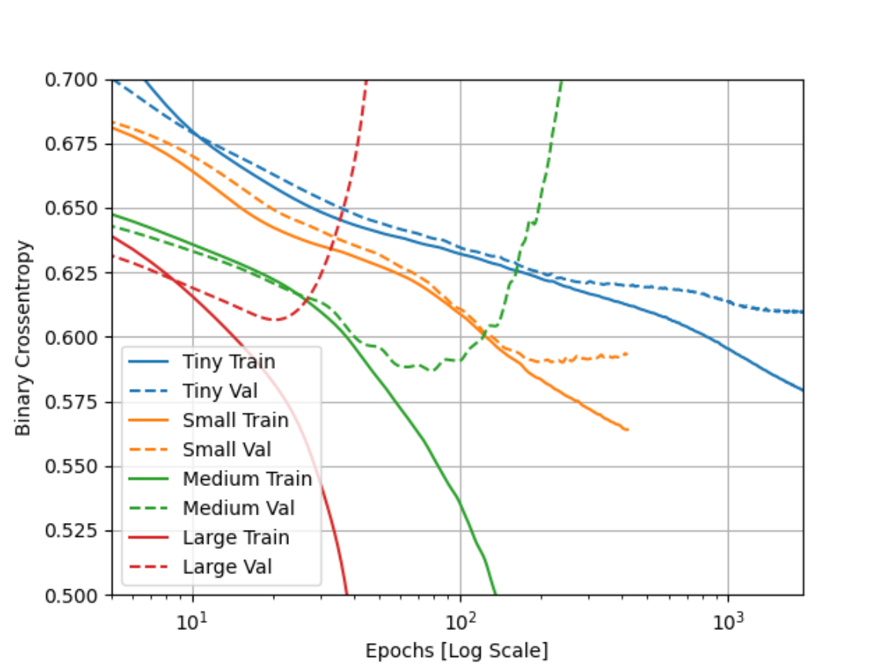
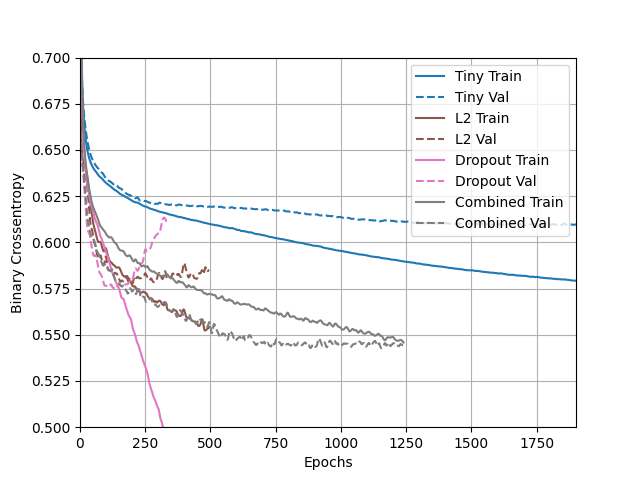

# Higgs Dataset Exercise

### Describe the dataset. What type of variable is the target? How many features are being used? How many observations are in the training dataset? How many are used in the validation set?

The goal of building a machine learning model on this dataset is "distinguish between a signal process which produces 
Higgs bosons and a background process which does not". The target variable is an integer: either 1
for 'produced' or 0 for 'not produced'. There are 11,000,000 data points, 500,000 of which
are used as a test/validation set. Therefore, 10,500,000 points are used in the training set. But to keep
it simple, our code uses the first 1,000 points as a testing set, and 
the next 10,000 points for training.

Additionally, there are 28 features total in this dataset. The first 21 features are regular features used to figure out if there are Higgs boson particles 
being produced, and the last 7 are functions of the first 21 features.

### How did each of the four models perform (tiny, small, medium and large)? Which of the four models performed the best? Which ones performed the worst? Why in your estimation did certain models perform better? Produce a plot that illustrates and compares all four models.

As shown by my plot, I would say that either the Small or Tiny model performed the best.
The Small Model has the lowest Binary Crossentropy value for the 
validation dataset, and it reached that relatively quickly
without overfitting. The Tiny model looks like it is the 
best model for long term testing, as it looks like it somewhat 
avoided overfitting for all of the epochs
displayed and the crossentropy value might get smaller with more
testing.

As for which model performed the worst, I would say 
that it is the Large Model. The validation values suddenly became 
very large at an early epoch. 

The TensorFlow website says that larger models
have more power, but if the power is not constrained then the model can
easily become overfit and have a higher Binary Crossentropy value. 
In our case, this is probably what happened, given that with each
level, the model increased by 1 layer and (for all except tiny --> small) the nodes in that layer increased
by a power of 8.

### Apply regularization, then add a drop out layer and finally combine both regularization with a dropout layer. Produce a plot that illustrates and compares all four models. Why in your estimation did certain models perform better?

Here is my graph that compares the 4 methods.

In my opinion, the Tiny model performed better than the other 3
models. It was not too overfit like the Dropout model, and not underfit 
either. It also was the most consistent over time, and was able
to get through many epochs. I just think that this model is 
the best for the same reason as above. This model is very powerful,
and making it very large could result in some wild overfitting
like in the Dropout model. 

I think that the Dropout model performed poorly because there are
so many features, that it may have just set too many features to
'0'. And then when it ran the testing set, there just weren't enough 
features to get accurate outputs. That's why I think the Combined
Model is second place, since it uses both Dropout and L2 
regularization, which prevents the weights from going all the 
way to 0. 

### What is an overfit model? Why is it important to address it? What are four different ways we have addressed an overfit model thus far?

An overfit model is a model that performs well on the training
data, but poorly on the testing data/validation data.

It's important to address overfitting, because that could 
mean that the dataset is training itself to only recognize 
data points from the training set. For example, take a model that was 
trained to recognize images of flowers. However, the training dataset
mostly consisted of yellow flowers while the validation set
had pink and yellow flowers. A good model would recognize both
pink and yellow flowers, but an overfit model would recognize only
yellow flowers. 

This could be harmful because an overfit program cannot generalize
and make predictions on new data. 

The four ways that we have addressed an overfit model are: 
- L1 Regularization
- L2 Regularization
- Dropout
- L2 + Dropout

