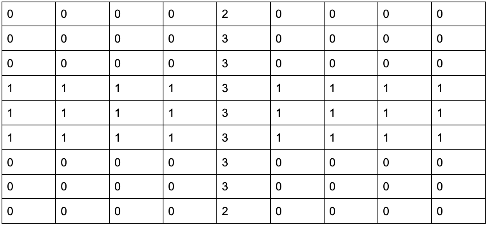

# Convolutions and Pooling

## Convolution

The filter that I chose to run three times was:

    [ [-1,-1,-1], [-1,0,1], [1,1,1] ]

### My First Run

The image looked like this after the first run:

This run focused on vertical and diagonal lines more than horizontal lines. 
When I do convolution, I am essentially putting the matrix that I
made over a 3x3 grid of pixels, but focusing on the center one.
I am then multiplying each value in my matrix with its corresponding
pixel, and adding up the total. Whatever the total is, it replaces
the center pixel. Then I move on to the next pixel and repeat. 

This is definitely useful for computer vision, as it can help
computers recognize outlines, straight lines, and shapes. 
Although, as we see in my next images, convolution should probably
only be done once. Otherwise, you will get a picture like my
second run. 

### My Second Run

The image looked like this after the second run:

This is weird! The well defined shapes that we saw before are
now gone, replaced by a sea of gray. The original picture
is barely visible. I am going to be honest, I don't really 
know how the image managed to become like this, especially at the 
top areas with the sky, which was previously all black.

### My Third Run

The image looked like this after the third run:

This is a stranger version of the previous image. 
The original image is not visible at all. Additionally, the 
black streaks in the middle of the second image were replaced
by white in this third run. That probably has to do with 
more grey pixels than black pixels getting in the same convolution
matrix layer.

## Pooling

The purpose of pooling is to go through the image, taking 
a grid of 2 x 2 pixels (it can be any amount), and
finding the greatest valued pixel in the grid. That pixel
then "replaces" the grid in the image, making the image smaller.
This is useful if you have many images to store, because it
reduces image size while maintaining the overall image. Here
is a pooling run of my first convolution run: 

As you can see, the image looks pretty much the same. The only 
difference is the axes on the side are from 0-256 instead of
0-512. That is a decrease by a power of 2. If I was storing
1,000,000 images and I performed pooling, that would free up
half of my storage space. 

## Convolution Over Matrix

I took the top matrix and used it to perform one convolution
run on the bottom matrix. 

This is my result:

