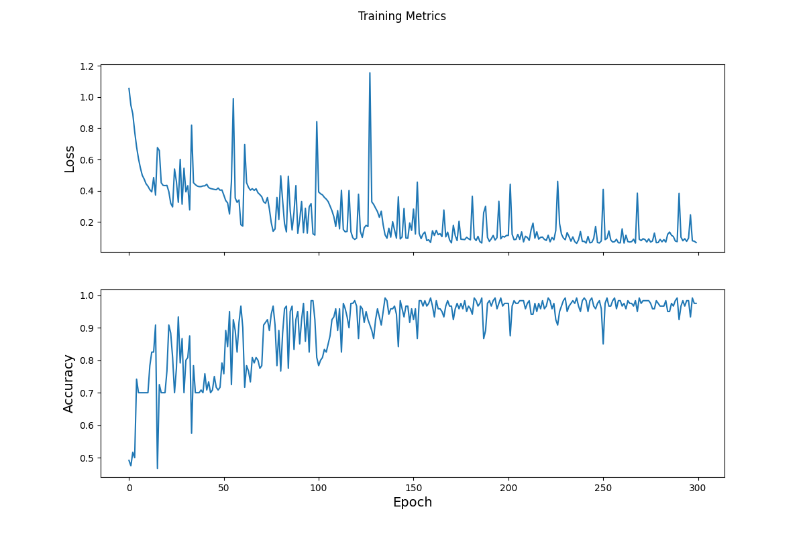

# Custom Training - Walkthrough

The data that I used in this model was the iris data. It had 
petal length, sepal length, petal width, and sepal width as features,
and the type of iris as labels.

I was able to make a tf.data.Dataset by using the make_csv_dataset
function. This function converts a given csv into a dataset. You also have 
to tell the function which columns you want to keep as features
and which you want to make a label. This model is nice if you 
want to try different labels. 

This is the model that I chose:

    model = tf.keras.Sequential([
    tf.keras.layers.Dense(20, activation=tf.nn.relu, input_shape=(4,)),  # input shape required
    tf.keras.layers.Dense(15, activation=tf.nn.relu),
    tf.keras.layers.Dense(10, activation=tf.nn.relu),
    tf.keras.layers.Dense(5, activation=tf.nn.relu),
    tf.keras.layers.Dense(3)
    ])

It has 5 layers, starting at 20 and funnelling down to the final 3.
I thought that starting big and going small would help the model
be more specific. The input shape is 4, because there are 4 different
input features - petal length, sepal length, petal width, and sepal width. 
I did not change the tf.keras.losses.SparseCategoricalCrossentropy function.
I just didn't see a reason to change it, as it returns the 
average loss.

For my optimizer, I chose a learning rate of 0.05.

    optimizer = tf.keras.optimizers.SGD(learning_rate=0.05)

When I was testing values, this learning rate had the lowest
loss values. Although the loss values changed when I reran my
code - I'm not sure why. However, regardless of the changes, 0.05 
had the best values. 

I chose to run my model for 500 epochs, because I thought
that running it for longer could give the model a chance
to get a higher accuracy.

    Epoch 000: Loss: 1.119, Accuracy: 39.167%
    Epoch 050: Loss: 0.363, Accuracy: 87.500%
    Epoch 100: Loss: 0.459, Accuracy: 76.667%
    Epoch 150: Loss: 0.094, Accuracy: 98.333%
    Epoch 200: Loss: 0.092, Accuracy: 98.333%
    Epoch 250: Loss: 0.090, Accuracy: 94.167%
    Epoch 300: Loss: 0.054, Accuracy: 98.333%
    Epoch 350: Loss: 0.057, Accuracy: 97.500%
    Epoch 400: Loss: 0.063, Accuracy: 98.333%
    Epoch 450: Loss: 0.060, Accuracy: 97.500%
    Epoch 499: Loss: 0.279, Accuracy: 95.833%

So my accuracy after 500 epochs was 95.833%. 
I noticed that the accuracy actually began to fluctuate
and decrease around 150 epochs, and the loss also
began to increase after 300. So I decided to run it again, with only
300 epochs.

    Epoch 000: Loss: 1.055, Accuracy: 49.167%
    Epoch 050: Loss: 0.372, Accuracy: 75.833%
    Epoch 100: Loss: 0.392, Accuracy: 78.333%
    Epoch 150: Loss: 0.282, Accuracy: 92.500%
    Epoch 200: Loss: 0.114, Accuracy: 97.500%
    Epoch 250: Loss: 0.408, Accuracy: 85.000%
    Epoch 299: Loss: 0.068, Accuracy: 97.500%

This definitely gave me the highest accuracy and the lowest
loss. I decided to keep 300 epochs in my final model.

Here is the plot for both loss and accuracy that describes
the change per epoch:

Compared to the graphs on the website, my model fluctuates
more. This may be because I increased the optimization 
learning rate. 

When I tested my test set, I got a very high accuracy.

    Test set accuracy: 96.667%

When I ran the given array through my model, it was able
to predict values at a very high accuracy.
    
    predict_dataset = tf.convert_to_tensor([
    [5.1, 3.3, 1.7, 0.5,],
    [5.9, 3.0, 4.2, 1.5,],
    [6.9, 3.1, 5.4, 2.1]
    ])

    Example 0 prediction: Iris setosa (99.8%)
    Example 1 prediction: Iris versicolor (99.5%)
    Example 2 prediction: Iris virginica (95.3%)

I tried 3 more predictions. All of these numbers were
chosen at random. 

    predict_dataset = tf.convert_to_tensor([
    [2.6, 1.3, 0.7, 2.5,],
    [9.9, 2.3, 4.9, 0.5,],
    [1.2, 4.0, 4.4, 1.1]
    ])
    
    Example 0 prediction: Iris virginica (55.7%)
    Example 1 prediction: Iris versicolor (73.3%)
    Example 2 prediction: Iris virginica (93.7%)

My third example had the highest prediction value. 

