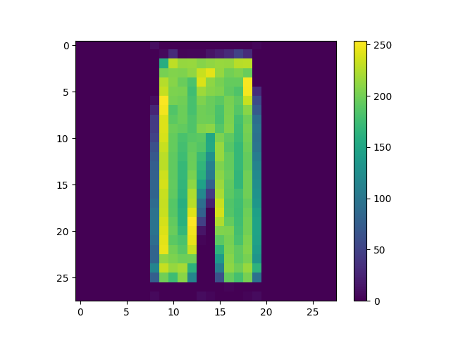
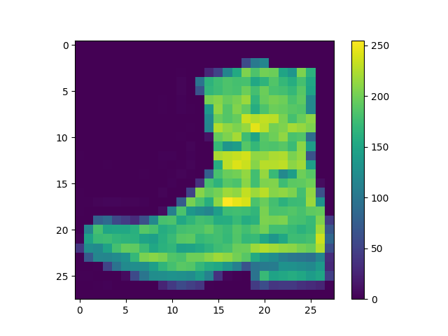
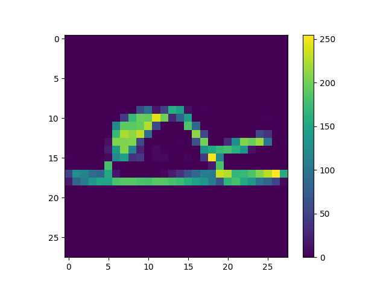
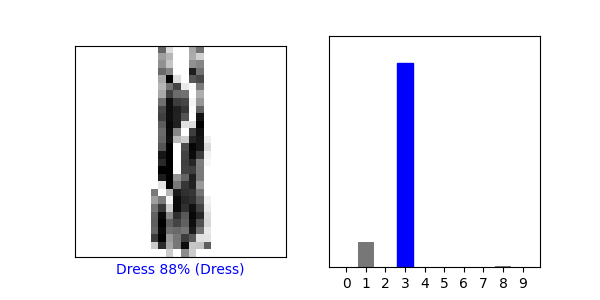
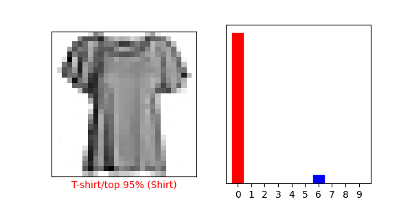
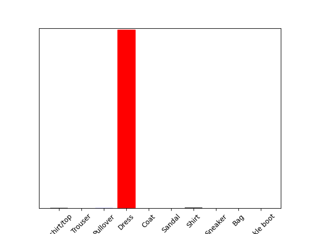
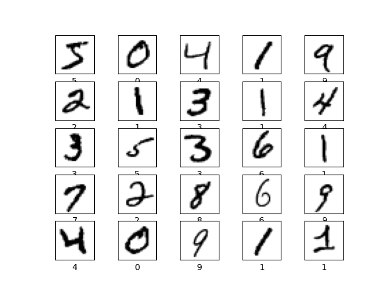
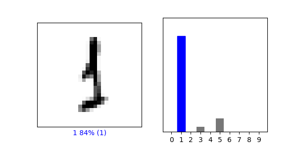
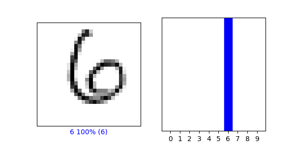

# Wednesday Q&A

# Part 1

## Preprocess the Data
### Three New Images:
### Index = 21

### Index = 10040

### Index = 59348

## Make Predictions
### Array of Predictions for Index 32 in the Test Set:
    array([9.4625633e-05, 1.0987158e-01, 4.3477034e-05, 8.8359582e-01,
       5.6092445e-05, 1.6385588e-08, 1.4731237e-04, 4.7754036e-09,
       6.1910413e-03, 9.3569055e-09], dtype=float32)
For each index in this array, the value represents the probability that 
that index is the correct label for the image. For example, index 0 correlates 
to 'Tshirt/top' in the labels array, and the model predicts that the image
has a 9.4625633e-05 probability of being a 'Tshirt/top'. 

I used np.argmax() to get the index of the maximum value in the predictions 
array, while I used Softmax to generate the predictions array. Softmax
converts the output into probabilities.

The output from np.argmax() was 3, and the label from the 
test_labels data set was also 3. 

## Verify Predictions

### Index 32:

### Index 565:

## Use the Trained Model:

I used the index 1001. 

The predicted value was 3, which matches the test label.

It does not seem like I used Softmax in this section, because 
it is not mentioned by name however, in the line
    
    predictions_single = probability_model.predict(img)
, I used a variable called probability_model. This is defined 
earlier on in the code. 

    probability_model = tf.keras.Sequential([model, tf.keras.layers.Softmax()])

This uses Softmax.

# Part 2

## MNIST Data

After fitting the data, the accuracy of the training set is:

    0.9949
The accuracy of the testing set is:

    0.9790

## Verify Predictions

### Index 900:

### Index 100:

## Accuracies

I believe that the MNIST model is more accurate as opposed to
the Fashion MNIST model, because the training score for the Fashion
MNIST model is 

    0.9100
while the score for the MNIST model was 

    0.9949
as shown above. However, the testing score is more important.
The test accuracy for Fashion MNIST is 

    0.8863000273704529
, which is less than the testing accuracy for MNIST. Therefore,
the MNIST dataset is more accurate.

I am not sure why the MNIST dataset performed better than the 
fashion dataset. Perhaps it is because clothes and shoes are 
harder to tell apart than simple numbers.