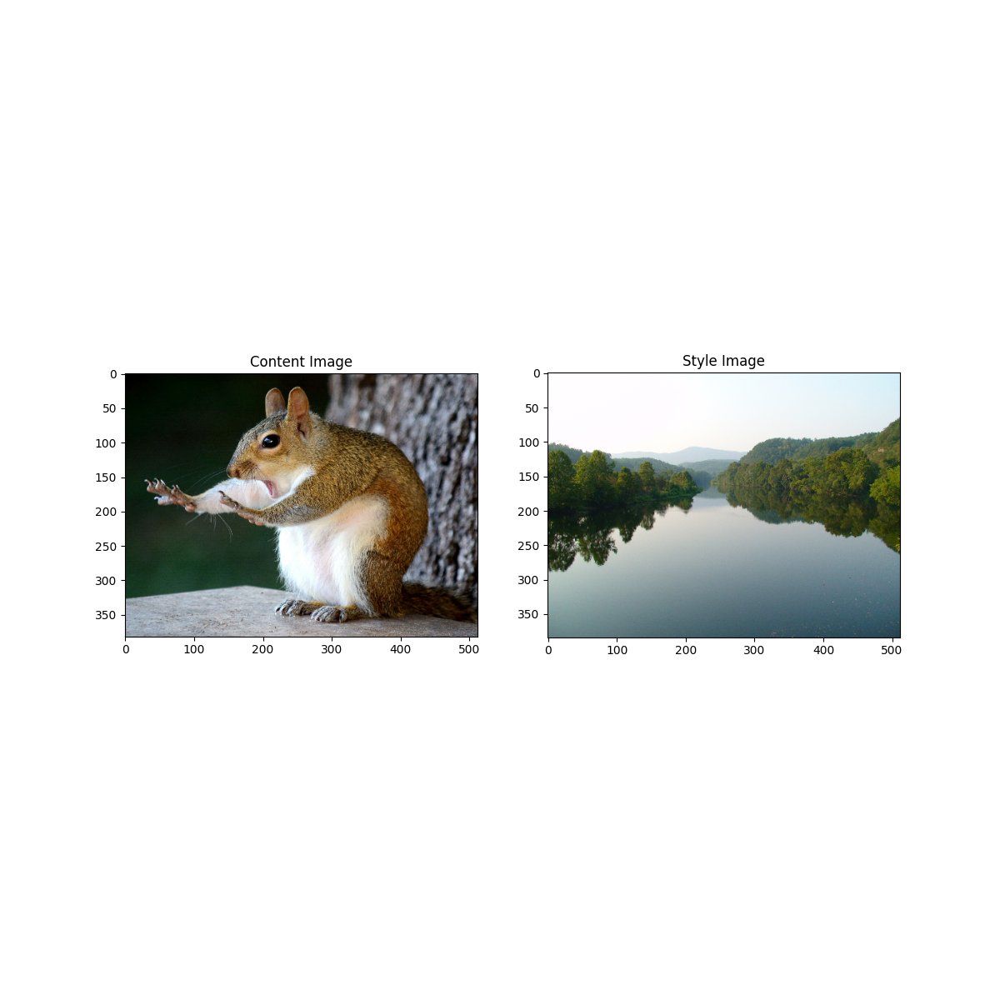
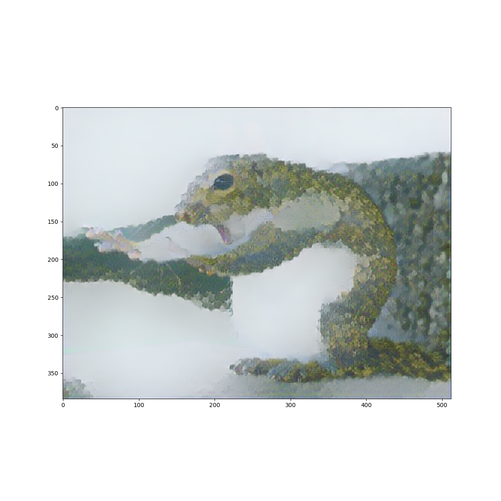
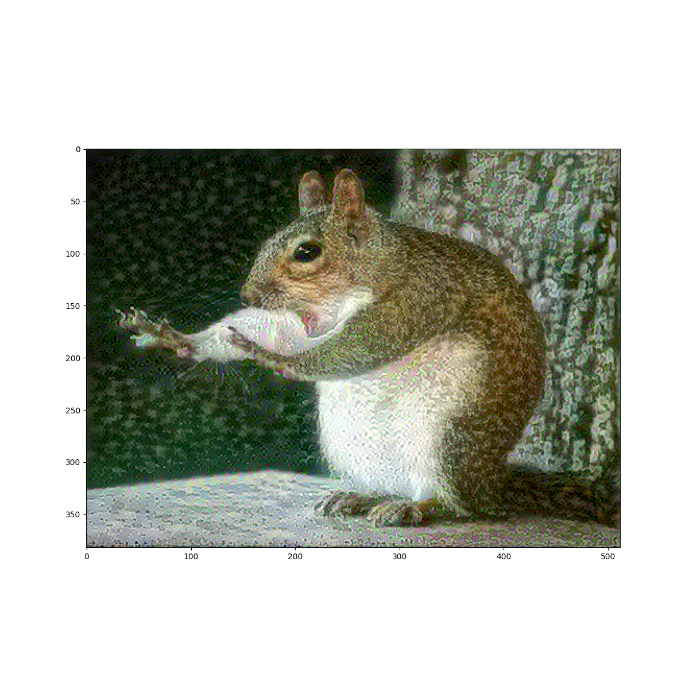
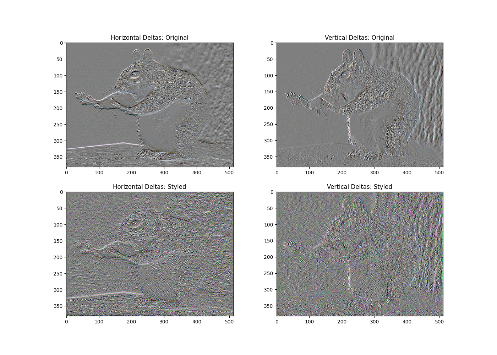

# Combining Images

The two images I chose were a squirrel and a landscape photo from
Wingina, VA. 

I chose the squirrel because I thought it looked funny and cute, but 
also because it represented how nervous/scared I was coming into the 
Jump Start Program. I don't have a background in Data Science, even though
I am a CS major. So I didn't really know what I was getting myself into.
The Style Image is a landscape from Wingina, VA, a place where my family
and I went on vacation this summer. I chose this combination of images
because they represent how I was able to do this program while being able to spend time with 
my family. 

After combining the images using the Tensorflow hub model, this is what I got. 

I also ran it with the model provided in the source text. There were
3 epochs with 10 steps per epoch. This is the resulting image:

I prefer the first model, just because it makes the image look a little
wacky and fun, and you can see the elements of the landscape, like
a mountain and river. This model looks more like a painting of a squirrel,
and the landscape is not visible at all. 

### Choosing the Style and Content Images

The style and content images were, as shown above, a landscape and 
a squirrel (respectively). 

### Extracting Style and Content

This model used a Gram matrix to create the style of the image.
I also chose some layers to represent the style and one layer to 
represent the content. These layers were the default layers given
in the Tensorflow website. I also defined an extractor, which uses
both style and content layers. This will be used in the next step.

### Implementing the Style Transfer Algorithm 

The style transfer algorithm takes the extractor and splits it into
style targets and content targets. It then goes through the image, 
and calculates the mean square error on the output relative to the 
target, and takes a weighted sum of the loss. After running the
train_step method a few times, we get an image that is not a 
big mess and looks a bit more cohesive.

### Regularization

This is the image that I got when I ran regularization. 

We can see that the area of the tree stayed relatively the same
for both vertical and horizontal deltas. The belly of the 
squirrel stayed pretty much untouched as well. The areas
of most change I would say are the squirrel's fur, and the 
sky around it. 

